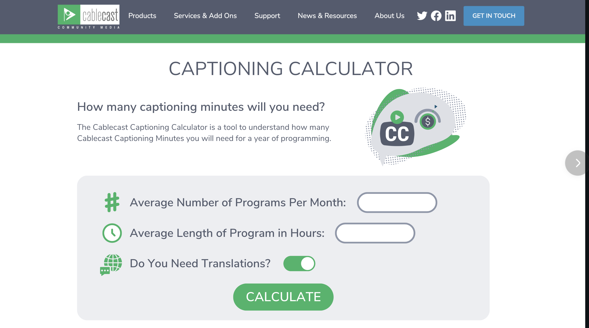
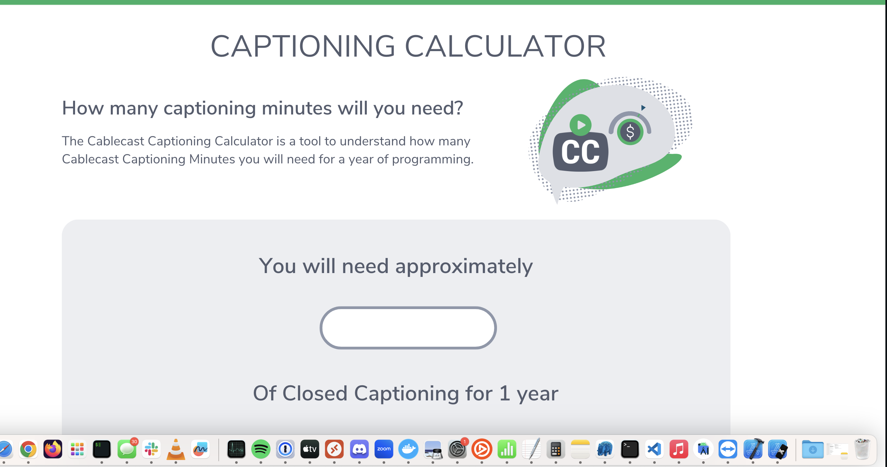

# Cablecast Web Developer Take Home Assignment

Thanks for taking the time to apply with us. We really appreciate it. The goal of this project is to guage how you work the way we work, remotely, largely indepenently, colobarating as needed. If you run into any issues at all with this project or have any questions please reach out to @raytiley.

- [Remix Docs](https://remix.run/docs)

This project uses the remix.run framework to setup a very simple [Resource Route](https://remix.run/docs/en/main/guides/resource-routes) which is a simple way to get some basic api endpoints into the project. The endpoint is designed to take ether json or form encoded data of leads captured from a Closed Caption Usage calculator you will be building.

The engineering team got this mockup from our marketing department. It's built in Canva, so we unfortunetly don't have design resources like illustrator files or figma. The design is also a bit incomplete. It doesn't have the `name` and `email` field required for actual lead capture.

* This is a contrived example :) The marketing department is actually planning on putting this behind a gated page on our website where you already have to provide your name / email to access the calculator. For "real world" dealing incomplete resources is why I'm throwing in some curve balls. 

## Running This Code

- Fork and Pull The repository
- `npm install`
- `npm run dev`
- visit `http://localhost:3000`

## The API

The lead api is located in this project is in `app/routes/api.leads.tsx`. It can take a `Lead` as ether `json` or `formData`. It mocks out saving it by simply `console.log` the data it receives.

```
interface Lead {
    name: string;
    email: string;
    averageProgramsPerMonth: number;
    averageLengthOfProgramsInHours: number;
    needsTranslations: boolean;
}
```

## Project Goals

Using the mockups below implement a prototype of a closed caption calculator that can be used to capture leads for our Closed Captioning Project.

The formula is `yearlyCaptionMins = averageProgramsPerMonth * averageLengthOfProgramsInHours * 60`;

### What We Are Looking For

- Git / Node Proficancy - Can you get this project forked / cloned running locally.
- CSS / Design Implementation Proficancy - Can you take this design and implement it in CSS.
- Javascript Proficancy - Using browser apis / frameworks take the data from the client and submit it to the server.
- Collaboration - We would like you to write a pull request to this project (or your own repo) with the data explaining your changes. We want to see how you work.






## Details

### Don't worry about any of the website navigation / chrome.

We are only worried about the caption calculator.

### You can use as much or as little of this project as you want. 

For example you could use just the API and use your own favorite starter project for your framework of choice to submit the data entirely client side.

### You can change anything. 

Switch out frameworks, modify the code I already put in, use different CSS libraries. This is just a starter, everything can be trashed.

### The design does not need to be pixel perfect

The design doesn't have to be pixel perfect, it should be prototype quality. It should resemble the mockup, but don't spend hours getting fonts, shadows, gradients exactly perfect.

